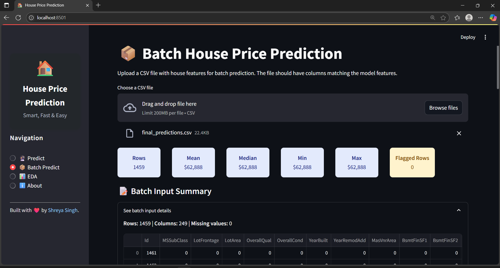

# 🏠 House Price Prediction App

Welcome! This project helps you predict house prices using real data and a smart machine learning model. You can use it to explore the data, make predictions for a single house, or upload a list of houses and get prices for all of them at once—all through a simple web app.

#### Live Demo: [jobfit-resume-analyzer](https://jobfit-resume-analyzer.streamlit.app/)
---

## What’s Inside

**Folders and Files:**
- **data/** – All the data files: the original data, cleaned data, and processed data ready for modeling.
- **models/** – The trained model and a file listing the features it uses.
- **notebooks/** – Step-by-step Jupyter notebooks for data cleaning, feature engineering, and making predictions.
- **output/** – The results, including final predictions and a summary of what’s in this folder.
- **src/app.py** – The main Streamlit app. This is what you run to use the web interface.
- **requirements.txt** – A list of all the Python libraries you need.
- **README.md** – This file! Explains the project and how to use it.
- **approach.md** – A detailed, technical explanation of how everything works.

---

## Screenshots

### Predict


### Batch Predict



### EDA


### About


> And that's just a glimpse! The app is packed with even more powerful features and interactive tools — uncover them all by exploring the app yourself and see how much more it can do beyond these screenshots.

---

## What This Project Does

- **Cleans and explores the data** so the model can learn from it.
- **Creates new features** (like total square footage and house age) to help the model make better predictions.
- **Trains and tests several machine learning models** to find the best one.
- **Lets you use a web app** to predict house prices, either one at a time or in batches.
- **Shows you data insights** with easy-to-understand charts and graphs.

---

## How to Use the App

### 1. Run Locally

1. Make sure you have Python installed.
2. Install everything you need:
   ```
   pip install -r requirements.txt
   ```
3. Start the app:
   ```
   streamlit run src/app.py
   ```
4. The app will open in your browser. Use the sidebar to pick what you want to do!

### 2. Run on Streamlit Cloud

- Push this project to GitHub.
- Go to [Streamlit Cloud](https://streamlit.io/cloud) and deploy your app (just point it to `src/app.py`).

---

## What Can You Do in the App?

- **Predict:** Enter details about a house and get an instant price prediction, with a summary and a chart showing how your house compares to others.
- **Batch Predict:** Upload a CSV file with lots of houses and get predictions for all of them. Download the results to your computer.
- **EDA:** Explore the data with interactive charts—see price distributions, feature importance, and more.
- **About:** Learn what the app does, how to use it, and how to contact the developer.

---

## What’s in the Output Folder?

- **final_predictions.csv:** The predicted prices for the test data.
- **output.txt:** A simple explanation of what’s in the output folder and what each file is for.

---

## What Libraries Do You Need?

- pandas
- numpy
- matplotlib
- seaborn
- scikit-learn
- xgboost
- joblib
- streamlit
- xlsxwriter

(Install them all with `pip install -r requirements.txt`.)

---

## Want to Know How It Works?

Check out `approach.md` for a step-by-step explanation of the data science and machine learning process behind the scenes.

---

## Developer?

Made by Shreya Singh.  
Want to connect or have feedback? [Find me on LinkedIn!](https://www.linkedin.com/in/shreya-singh-561a591a5/)

---

If you have any questions or want to improve the project, feel free to reach out. Happy predicting!

---
